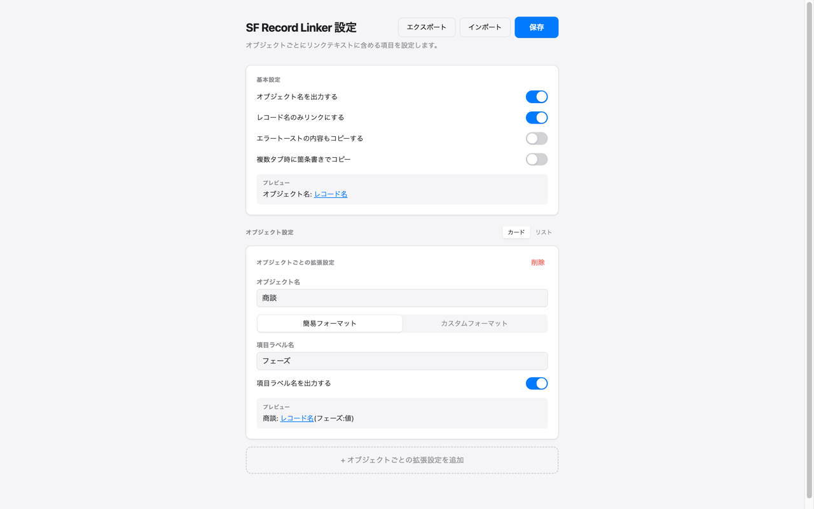

# SF Record Linker

A Chrome extension for Salesforce Lightning that copies record page links to your clipboard with a single click. Supports custom formatting, multi-tab bulk copy, and per-object field configuration.

Salesforce Lightning レコードページ用 Chrome 拡張機能。レコードへのリンクをワンクリックでクリップボードにコピーする。

## 機能

### 基本機能

- **ワンクリックコピー** — 拡張アイコンをクリックするだけでレコード名のハイパーリンクをコピー（リッチテキスト + プレーンテキスト）
- **レポートページ対応** — レポートの閲覧ページでもレポート名のリンクをコピー可能
- **レコードページ限定** — `declarativeContent` により Salesforce のレコードページ以外ではアイコンが無効化

### オプション機能（設定画面で有効化）

- **オブジェクト名出力** — リンクテキストの先頭にオブジェクト名を付加（例: `商品: Product A`）
- **リンク範囲の切り替え** — レコード名のみリンク化 / 全体をリンク化を選択可能
- **簡易設定** — オブジェクトごとに項目を1つ指定し、`レコード名(項目値)` 形式でコピー
- **カスタムフォーマット** — テンプレート変数（`${name}`, `${object}`, `${項目ラベル名}`）を組み合わせて自由な形式を定義
- **エラートーストコピー** — 画面にエラートーストが表示されている時、リンクの後ろにエラー内容を追記（`レコード名 / ⚠ エラー: ...`）
- **複数タブ一括コピー** — 複数タブを選択してまとめてコピー（箇条書きスタイル選択可能）
- **設定エクスポート/インポート** — JSON形式で設定の保存・復元が可能

## 使い方

### 基本操作

1. Salesforce Lightning のレコードページ（またはレポートページ）を開く
2. 拡張アイコンをクリック
3. レコード名のリンクがクリップボードにコピーされる

複数タブを選択（Ctrl/Cmd + クリック）してからアイコンをクリックすると、選択中の全レコードページのリンクをまとめてコピーできる。

### 設定（オプション）

拡張機能の設定画面（右クリック →「オプション」）でコピー形式をカスタマイズできる。



#### 基本設定

| オプション | 説明 | デフォルト |
|-----------|------|----------|
| オブジェクト名を出力する | リンクテキストの先頭にオブジェクト名を付加 | OFF |
| レコード名のみリンクにする | ON: レコード名のみリンク化、OFF: 全体をリンク化 | OFF |
| エラートーストの内容もコピーする | エラートースト表示時にエラー内容をリンクの後ろに追記 | OFF |
| 複数タブ時に箇条書きでコピー | 複数タブ一括コピー時に箇条書き形式で出力。`<ul>` 形式または任意の接頭文字を選択可能 | OFF |

設定変更はプレビューでリアルタイムに確認できる。

#### オブジェクトごとの拡張設定

**簡易設定**: 項目を1つ指定して付加する。

| 設定 | コピー結果 |
|------|-----------|
| オブジェクト名: `商品` / 項目ラベル名: `商品コード` | `Product A(商品コード:ABC-001)` |

**カスタム設定**: テンプレート変数で自由なフォーマットを定義する。

| 変数 | 説明 |
|------|------|
| `${name}` | レコード名 |
| `${object}` | オブジェクト表示名 |
| `${項目ラベル名}` | Salesforce の項目ラベル名で値を参照 |

| フォーマット例 | コピー結果 |
|--------------|-----------|
| `${name}(${商品コード})` | `Product A(ABC-001)` |
| `[${object}]${name}(${商品コード} / ${カテゴリ})` | `[商品]Product A(ABC-001 / Electronics)` |

フォーマット内の項目が取得できなかった場合は、レコード名のみのリンクにフォールバックする。

オブジェクト設定はカード表示とリスト表示を切り替えて管理できる。

## セットアップ

```bash
npm install
npm run build
```

1. `chrome://extensions/` を開く
2. 「デベロッパーモード」を ON
3. 「パッケージ化されていない拡張機能を読み込む」で `dist/` ディレクトリを選択

## 開発

```bash
npm run dev       # watch モード（ファイル変更時に自動ビルド）
npm test          # テスト実行
npm run typecheck # 型チェック
```

コード変更後は拡張機能カードの更新ボタンを押し、Salesforce タブをリロード。

## プロジェクト構成

```
sf-record-linker/
├── src/
│   ├── content.ts        # Content Script（DOM探索・クリップボードコピー）
│   ├── background.ts     # Service Worker（アイコンクリック・declarativeContent）
│   ├── options/          # 設定画面（Preact + useReducer）
│   │   ├── components/   # UI コンポーネント
│   │   └── hooks/        # カスタムフック
│   └── lib/              # 共有ロジック（リンク生成・バリデーション・型定義・設定I/O）
├── tests/                # Vitest テスト
├── scripts/              # ビルドスクリプト（esbuild）
├── dist/                 # ビルド出力（Chrome 拡張として読み込む）
├── manifest.json         # Chrome Extension Manifest V3
└── icons/                # 拡張アイコン
```

## 技術スタック

- Chrome Extension Manifest V3
- TypeScript + esbuild（IIFE バンドル）
- Preact — 設定画面の宣言的 UI
- Vitest + @testing-library/preact（テスト）
- Service Worker + declarativeContent — レコードページでのみアイコン有効化
- Content Script（`*://*.lightning.force.com/*` で動作）
- Clipboard API — text/html + text/plain 両方をセット
- chrome.storage.sync — オブジェクトごとの設定を同期
